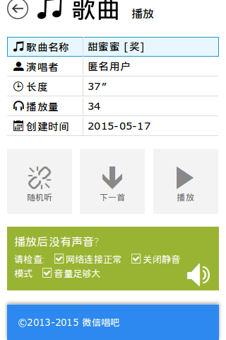
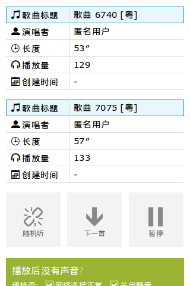
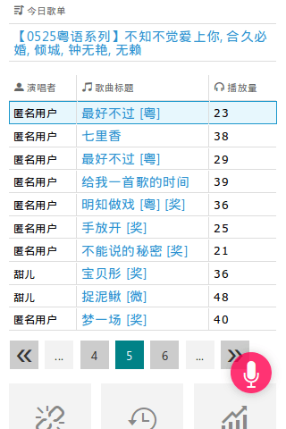
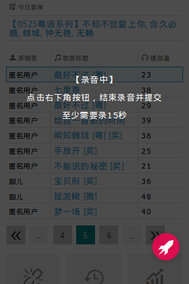
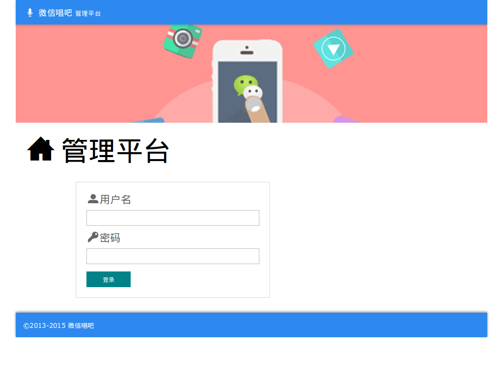
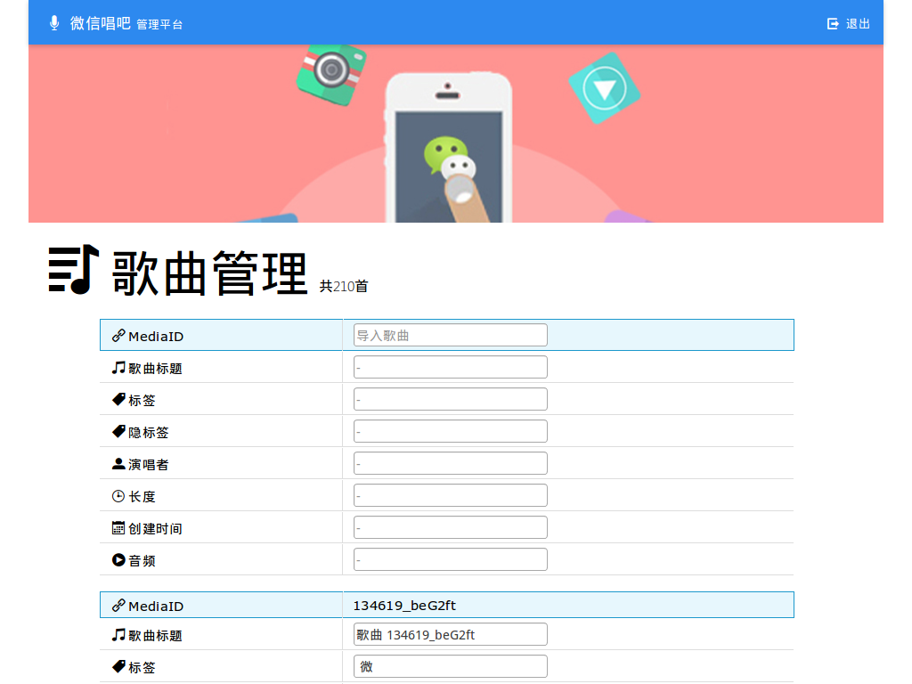
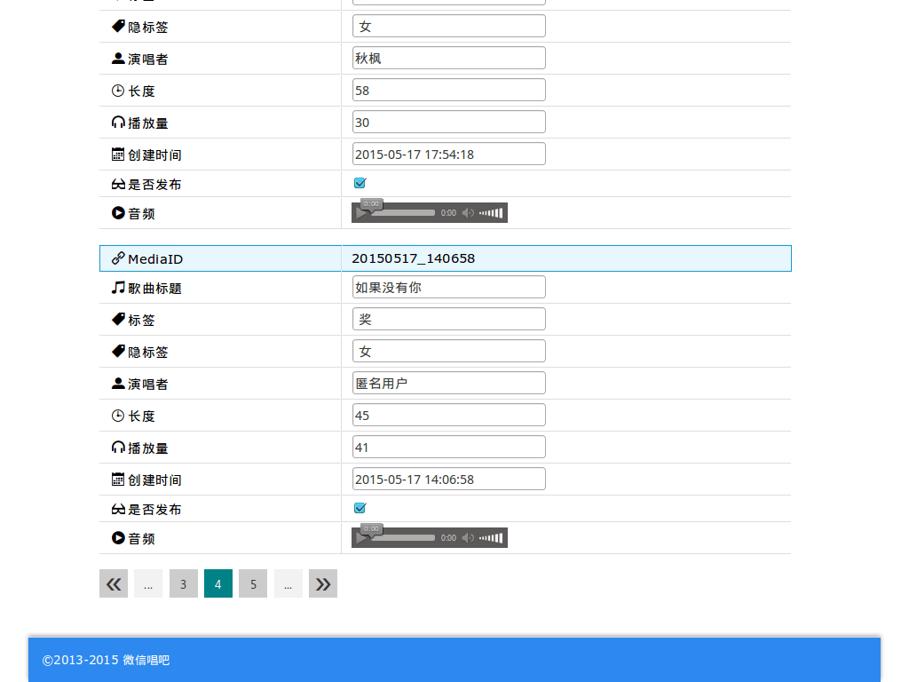
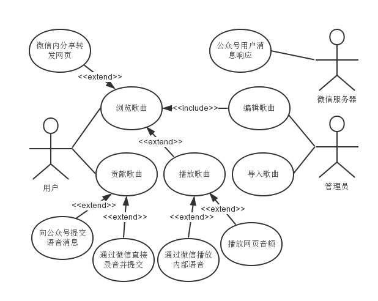
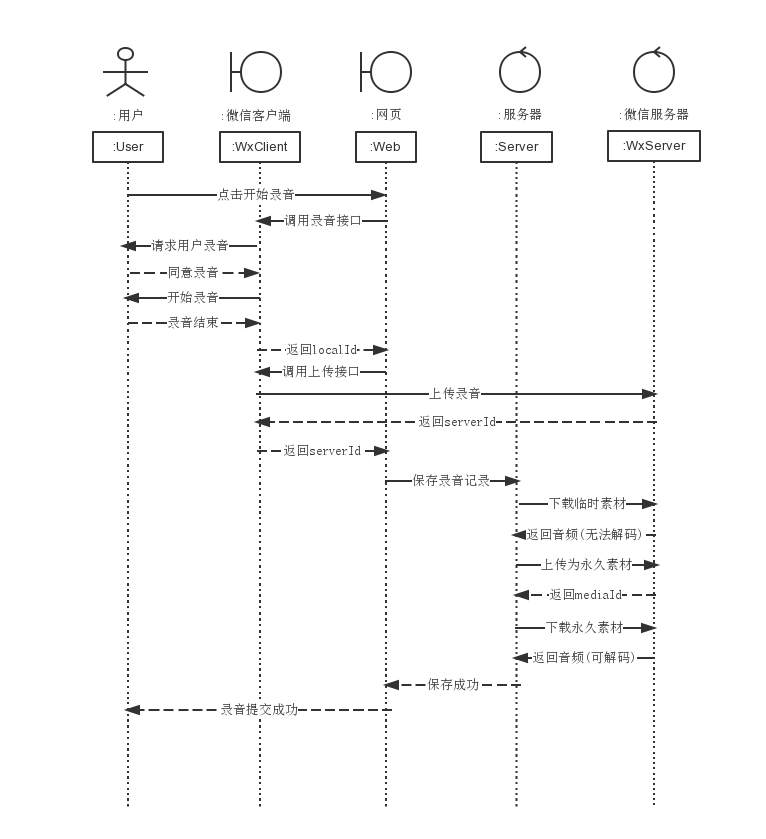
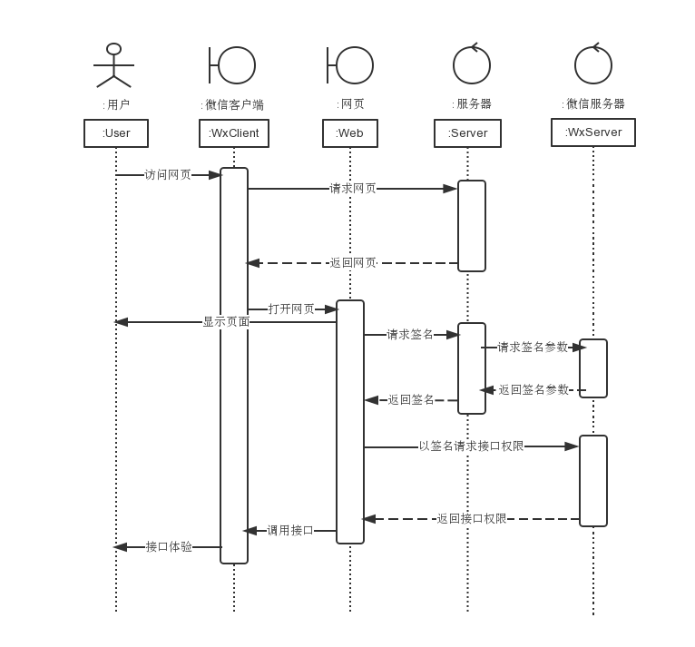

# 微信唱吧 `wxchangba`

- 历史仓库: (邑大唱吧) <https://github.com/fritx/wyu-sing>
- 0.1.x版本: (一分钟歌声) <https://github.com/fritx/wxchangba/tree/0.1.x>
- 新版本架构基于: (在线云频道) <https://github.com/fritx/channel>
- 微信唱吧入口: <http://changba.wx.fritx.me>

## 技术采用

- 前端主要基于zepto, 微信jssdk, metro-ui-css
- 后端主要基于express, lowdb, wx-connect, request/needle
- 后端配合前端使用lodash/_.template模板渲染页面

## 搭建指南

- 下载安装[nodejs](http://nodejs.org)
- 通过npm安装gulp/bower
- 下载源码到本地, 或直接从git克隆
- 进入目录, 安装npm/bower依赖
- 复制demo文件
- 自定义config文件
- 执行构建任务
- 以特定环境运行, 如dev/test/production, 默认dev

```
$ npm install --global gulp bower
$ git clone git@github.com:fritx/wxchangba.git
$ cd wxchangba
$ npm install && bower install
$ cp db-demo.json db.json
$ cp -r media-demo media
$ cp -r config-demo config
$ vim config/dev.js
$ gulp build
$ NODE_ENV=dev node .
```

## 效果图

### 手机屏幕

&nbsp;&nbsp;&nbsp;
&nbsp;&nbsp;&nbsp;
&nbsp;&nbsp;&nbsp;


### 平板屏幕

&nbsp;&nbsp;&nbsp;
&nbsp;&nbsp;&nbsp;


### 歌单播放 / 微信内网页录音

&nbsp;&nbsp;&nbsp;
&nbsp;&nbsp;&nbsp;
&nbsp;&nbsp;&nbsp;


### 管理平台

&nbsp;&nbsp;&nbsp;
&nbsp;&nbsp;&nbsp;


## 设计图

### 用例图



### 时序图-微信公众号语音


### 时序图-微信内网页录音



### 时序图-微信网页接口授权


